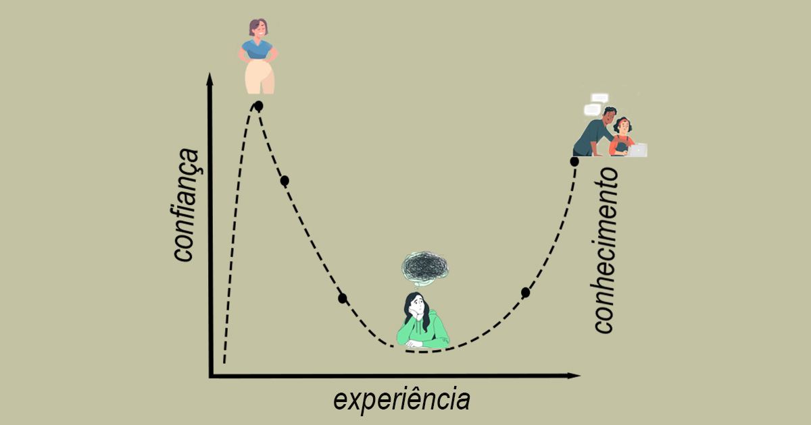

+++
date = '2026-09-21T21:49:42-03:00'
draft = false 
title = 'Efeito Dunning-Kruger'
type = 'blog'
tag = ["psicologia", "carreira"]
+++

## O efeito

O efeito Dunning-Kruger é um viés de confirmação que descreve a sistemática tendência das pessoas supervalorizarem seu conhecimento em uma área da qual não o possuem.É uma falta de conhecimento sobre sua própria ignorância. Traduzindo: Você acha que sabe mais do que realmente sabe

Em contra partida, pessoas que aceitam sua ignorância tendem a aprender mais. Acreditar que não conhece suficientemente um assunto te leva a estudar mais.

Segundo Dunker: "Quando a ignorância é reconhecida, é capaz que ela se transforme em desejo de saber, por isso, a busca por conhecimento parece ser essencial."

O efeito consegue ser mais aplicado em ativiades práticas onde é possível uma comparação direta, como esportes. Programação também!

## Na área de tecnologia

Júnior, pleno e sênior. Como exatamente definir o que é cada um? E, mais do que isso, como dizer objetivamente quando um júnior deixa de ser júnior e se torna pleno? Ou sênior?

Você provavelmente é menos do que acha que é. Há muitos profissionais plenos que, na realidade, são juniores. Muitos seniores que são, na verdade, meros plenos.

Na realidade, sempre seremos juniores em alguma coisa. Se uma nova tecnologia for lançada, um sênior será tão júnior quanto um júnior.

O importante é reconhecer que é ignorante e que há a necessidade do estudo constante, especialmente em uma área que muda muito em tão pouco. Tecnologias possuem prazo de validade e geralmente é de uma década, se muito.

Há poucos anos atrás estávamos falando em aprender HTML, CSS e JS para se tornar um "dev front-end". Programador apenas Front-end não existe!

O que já ouvi: Um Júnior deve ser capaz de realizar as mesmas atividade que um Sênior, dado tempo infinito. Ou seja, o júnior erra muito pois não sabe o melhor caminho. Ele tenta todos até descobrir qual o melhor. Um Senior já sabe o melhor pois já testou diversas vezes.

Todos querem passar de level o quanto antes, pois isso aumenta o salário. Cuidado para não se sabotar!
