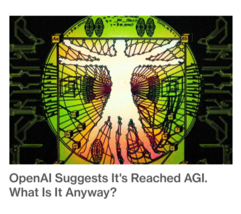
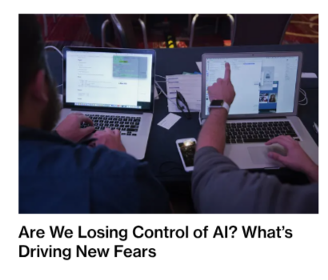
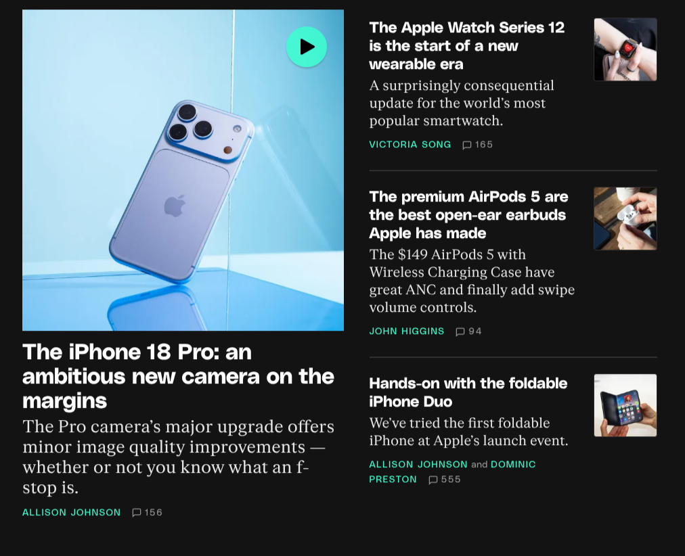
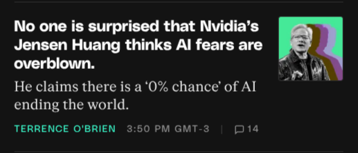

+++
date = '2026-09-20T17:04:49-03:00'
draft = false
title = 'Olá, Mundo!'
type = 'blog'
tags = ['unioeste']
+++

Este é o meu primeiro post do meu blog e o título não poderia ser outro!

A ideia deste blog é praticar a escrita e registrar o que estou aprendendo e o que está acontecendo no mundo da computação.

A inspiração para a criação de um blog e o dump de pensamentos é do Fábio Akita, que possui o blog [akitaonrails.com](https://akitaonrails.com)

Também será minha primeira experiênia com markdown!

## Situação atual

Estou no segundo ano de Ciência da Computação da Unioeste. Ainda não sei qual área gostaria de trabalhar. Veremos o que o futuro nos reserva!

A IA está em alta e mudou como programadores fazem sistema. ChatGPT lançou o GPT-6 Astra, Claude está no Fable 5.1. Dario Amodei e Sam Altman estão fazendo alarmismo dizendo que o mundo está em risco se não frearmos a escalada de IA. Batemos o teto de evolução? Ao contrário do que estes CEOs dizem, a IA não exterminará a humanidade nos próximos anos. Pode anotar.

A bolha das startups estourou recentemente. A apple está com um novo CEO (John Ternus, que era vice-presidente de engenharia de hardware) e acabou de lançar seu primeiro dobrável, o iphone DUO.

Abaixo deixarei registrado as principais manchetes atuais

## Principais manchetes do mundo da tecnolgia

